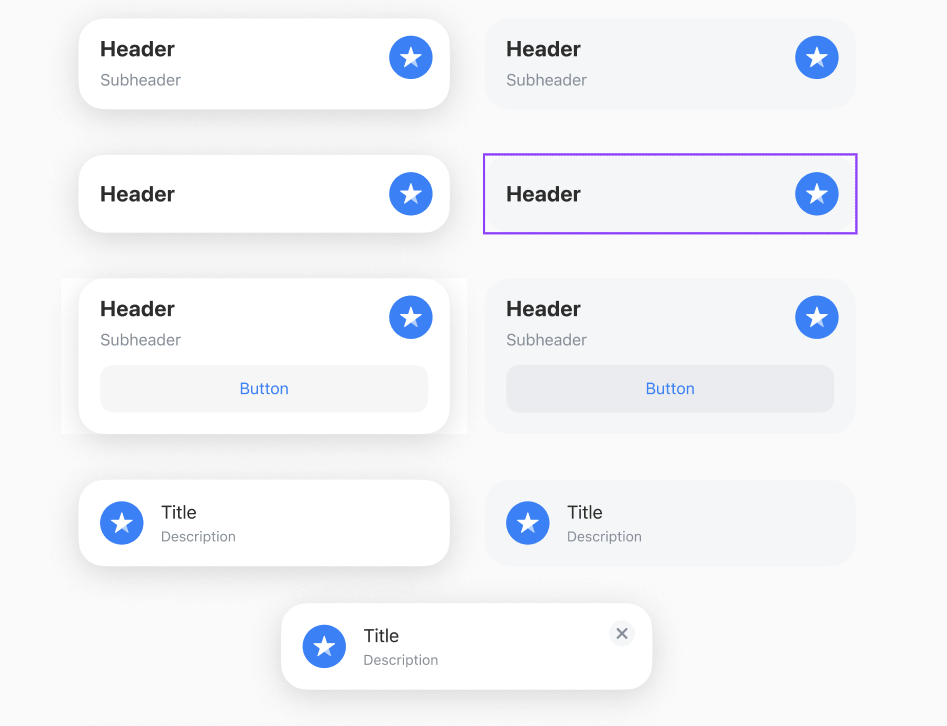
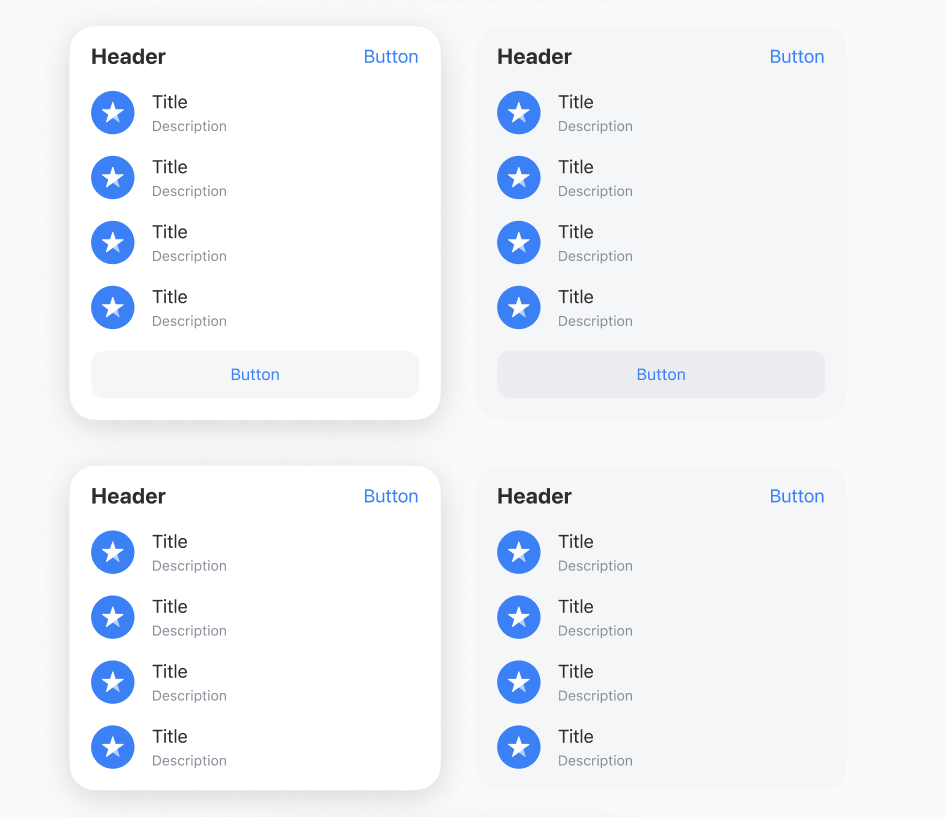
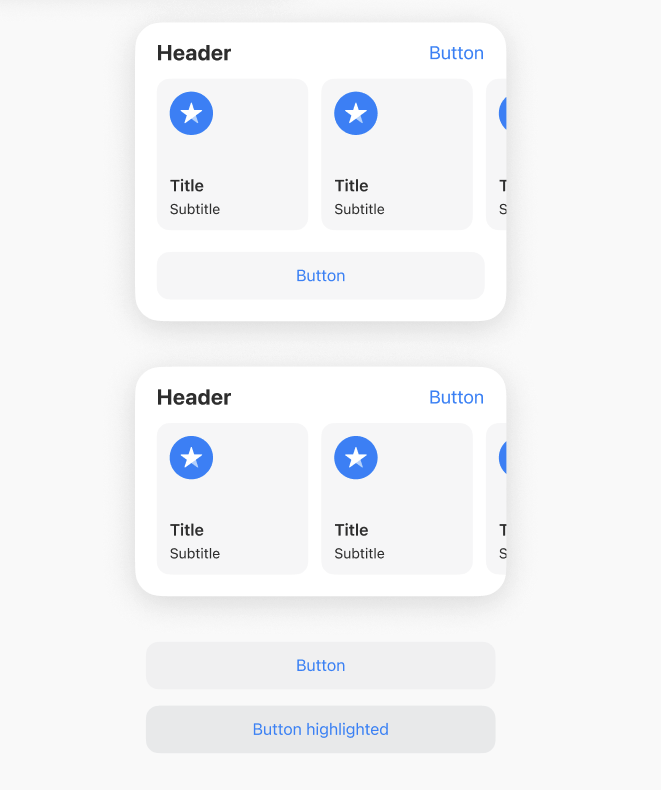

# Tinkoff Solutions Cup Final

This repository contains task for the Tinkoff Solutions Cup Final 2023

## Description
I took a 3 place on that cup. On **master** branch you can find a solution that I submited for the review.  Later, I'm going to improve it. Since I was limited in time, I wasn't able to implement all the functionality I wanted.

## Task 
Develop design system for the following design:
           Card            |  Vertical List            |  Horizonta/ List
:-------------------------:|:-------------------------:|:-------------------------:
   |  |  

### Requirements
- Design system has to be in a Swift Package
- The library should come with a demo application that includes all components in all styles.
* No crashes
+ Minimal deployment target iOS 14
- Use only UIKit
- Don't use third-party libraries
- Don't use Interface builder

